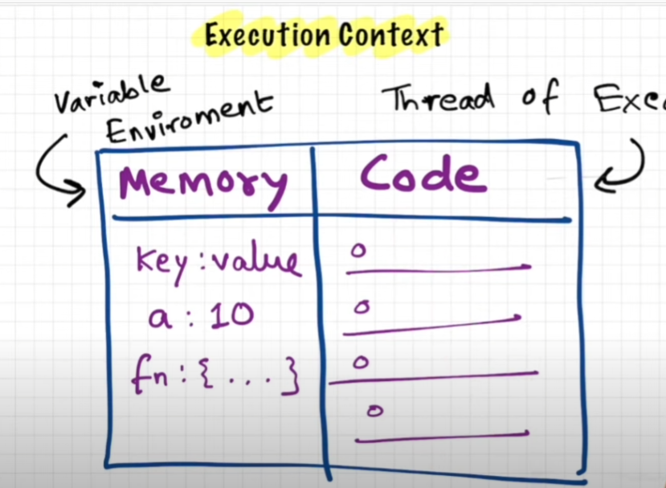
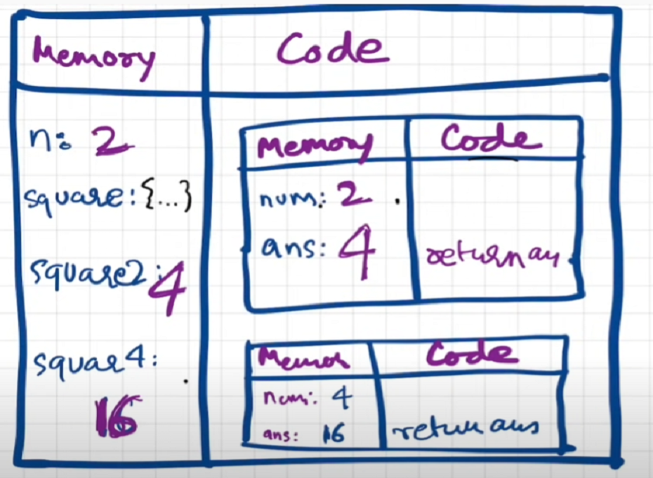

# namaste-js

## Episode 1 - How JavaScript Works 🔥& Execution Context

  

"Everything in javascript happens inside an Execution Context"  
"Javascript is a synchronous single-threaded language"  

Execution context is divided into two parts, that is, the memory part and the other is code part. In the memory part the variables and functions are stored in a key-value pair.

## Episode 2 - How JavaScript Code is executed? ❤️& Call Stack
  

When a javascript program is executed, an execution context is created. The Execution context is created in 2 phases - Creation phase(Memory creation phase) and Code execution phase.  

For the given code, in the first phase, JS will allocate memory to all the variables and functions.  
Memory part:  
n : undefined  
square : { ... }       //Stores the whole code of the function  
square2 : undefined  
square4 : undefined  

In the second phase, JS will execute the code.  
Memory part:  
n : 2  
square : { ... }       //Stores the whole code of the function  
square2 : 4  
square4 : 16  

When a function is being invoked, a new execution context is being created.  
The new execution context for the function in phase 1:  
Memory part:  
num : undefined  
ans : undefined  

The new execution context for the function in phase 2:  
Memory part:  
num : 2  
ans : 4  //num * num is executed in the code part and the result is stored in ans  

return keyword specifies that return the control of the program back to the place where the function was invoked. Once the program has been completed executed, the whole execution context is deleted.  

The Call stack is used to manage the execution contexts.
